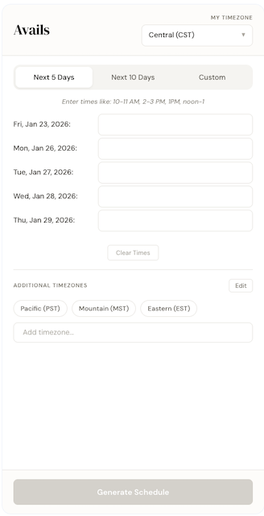

# Avails - Manual Availability Chrome Extension

A Chrome extension (Manifest V3) for quickly composing and sharing your availability across multiple timezones. Features a side panel interface with smart time parsing and support for 600+ IANA timezones.

> **Looking for v1?** The original popup-based version is available on the [v1 branch](https://github.com/aarongrobin/avails/tree/v1).

## Screenshots

**Start** - Enter your availability for upcoming business days
<br>

**Inputs and Formatted Schedule** - Smart time parsing with formatted output ready to copy
<br>

**Custom Dates** - Calendar picker for selecting specific date ranges
<br>

**Error Handling and Warnings** - Helpful error messages and timezone warnings
<br>

## Features

- **Side Panel Interface**: Opens as a Chrome side panel for easy access while browsing
- **Smart Time Parsing**: Flexible input formats (e.g., "10-11 AM", "2-3 PM", "noon-1", "10a-2p")
- **600+ Timezones**: Full IANA timezone database with smart search
- **Favorite Timezones**: Save frequently used timezones for quick access
- **Auto-Save**: Automatically saves your entries per date as you type
- **One-Click Copy**: Generate and copy formatted schedules to clipboard
- **Business Days**: Smart presets for remaining days this week or next 7 business days
- **Custom Date Ranges**: Select any date range from 1-30+ days
- **DST Aware**: Automatically handles Daylight Saving Time conversions

## Installation

### From Source

1. **Clone this repository**:
   ```bash
   git clone https://github.com/aarongrobin/avails.git
   cd avails
   ```

2. **Load the extension in Chrome**:
   - Open Chrome and go to `chrome://extensions/`
   - Enable "Developer mode" (toggle in top right)
   - Click "Load unpacked"
   - Select the folder containing this extension

3. **Use the extension**:
   - Click the Avails icon in your Chrome toolbar to open the side panel
   - Enter your availability for each date
   - Select target timezones for conversion
   - Click "Copy" to copy the formatted schedule

## Usage

### Entering Times

Enter times in a flexible, natural format:
- `10-11 AM` or `10-11 am`
- `2-3 PM` or `2-3pm`
- `10a-2p` (shorthand)
- `noon-1` or `12-1`
- `11 AM - 12 PM` (spaces are fine)
- Multiple slots: `10-11 AM, 2-3 PM, 5-6 PM`

### Date Presets

- **Rest of Week**: Remaining business days this week
- **Next 7 Days**: Next 7 business days (Mon-Fri)
- **Custom**: Select your own date range

### Timezone Conversion

1. Click "Add timezone" to select a target timezone
2. Search by city name, timezone abbreviation, or offset
3. Star timezones to add them to your favorites
4. Your local timezone is automatically detected

## Example Output

```
Monday, January 20
10:00 AM - 11:00 AM PST
  = 1:00 PM - 2:00 PM EST
  = 6:00 PM - 7:00 PM GMT

Tuesday, January 21
2:00 PM - 3:00 PM PST
  = 5:00 PM - 6:00 PM EST
  = 10:00 PM - 11:00 PM GMT
```

## Technical Details

- **Manifest Version**: 3
- **Permissions**: `storage`, `sidePanel`
- **Chrome Version**: 114+ (required for Side Panel API)
- **Storage**: Uses Chrome's `chrome.storage.local` API
- **Framework**: Vanilla JavaScript (no dependencies)
- **Timezone Data**: Uses browser's native `Intl` API

## Project Structure

```
avails/
├── manifest.json           # Extension configuration
├── background.js           # Service worker for side panel
├── popup/                  # Popup interface (toolbar click)
│   ├── popup.html
│   ├── popup.js
│   └── popup.css
├── sidepanel/              # Main side panel interface
│   ├── sidepanel.html
│   ├── sidepanel.js
│   └── sidepanel.css
├── js/                     # Core modules
│   ├── dateGenerator.js    # Date generation utilities
│   ├── timeParser.js       # Smart time parsing
│   ├── timezoneManager.js  # Timezone operations
│   ├── outputFormatter.js  # Schedule formatting
│   └── storageManager.js   # Chrome storage wrapper
├── components/             # UI components
│   ├── calendar.js         # Date picker
│   ├── timezonePicker.js   # Timezone search/select
│   └── favoritesManager.js # Favorite timezones
├── styles/
│   └── components.css      # Shared component styles
├── icons/                  # Extension icons
│   ├── icon-16.png
│   ├── icon-32.png
│   ├── icon-48.png
│   └── icon-128.png
└── README.md
```

## Version History

### v2.0.0 (Current)
- Complete rewrite with side panel interface
- Support for 600+ IANA timezones
- Favorite timezones feature
- Improved time parsing
- Per-date availability storage
- Modern modular architecture

### v1.0.0
- Original popup-based implementation
- Available on [v1 branch](https://github.com/aarongrobin/avails/tree/v1)

See [VERSION_NOTES.md](VERSION_NOTES.md) for detailed changelog.

## License

MIT License - Feel free to use and modify as needed.

## Contributing

Suggestions and improvements are welcome! Feel free to open an issue or submit a pull request.

---

**Privacy**: This extension stores data locally in your browser. Your availability data never leaves your machine.
